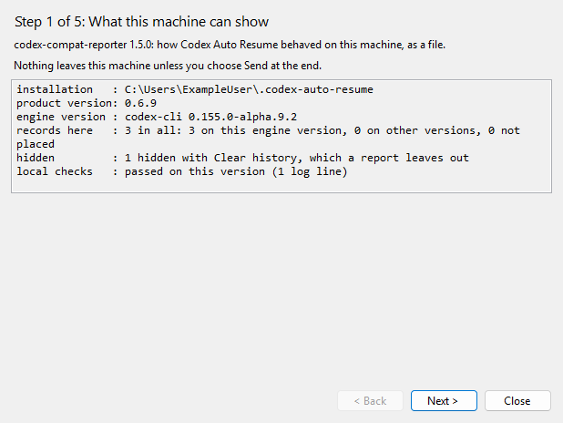
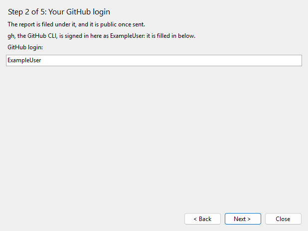
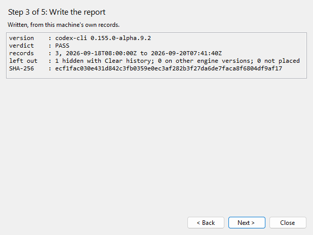
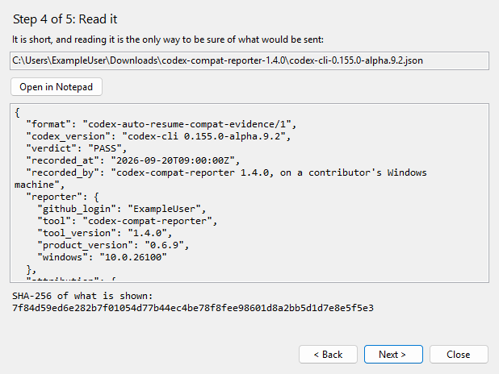
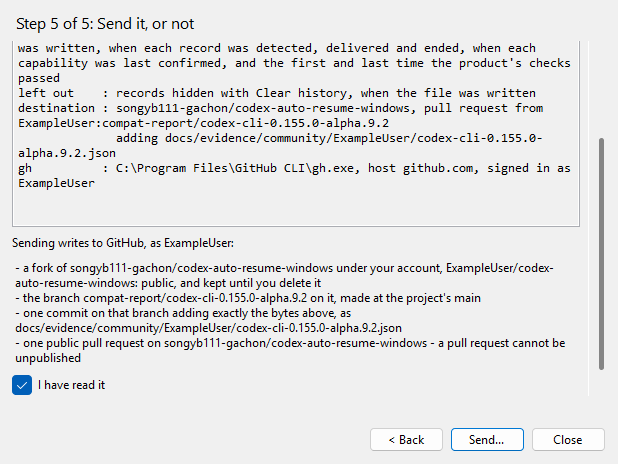
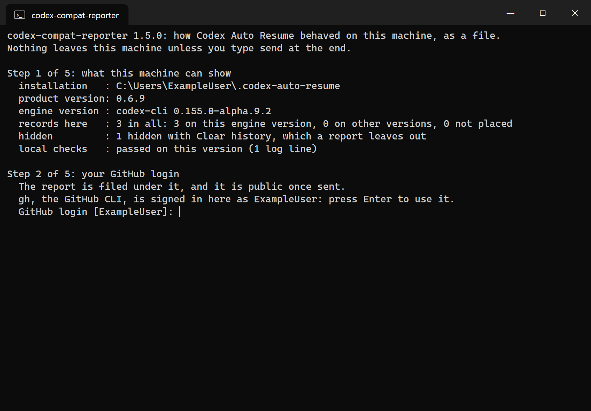
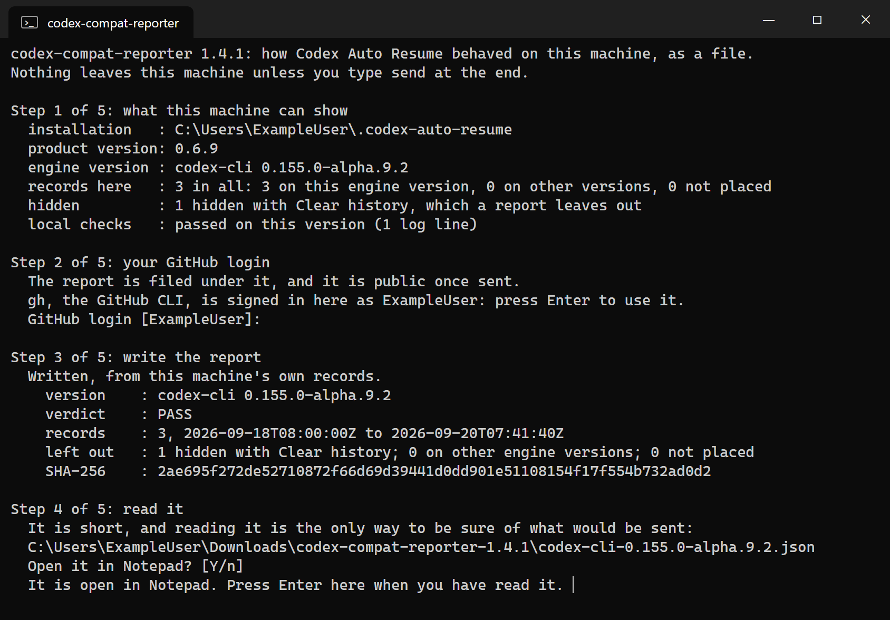
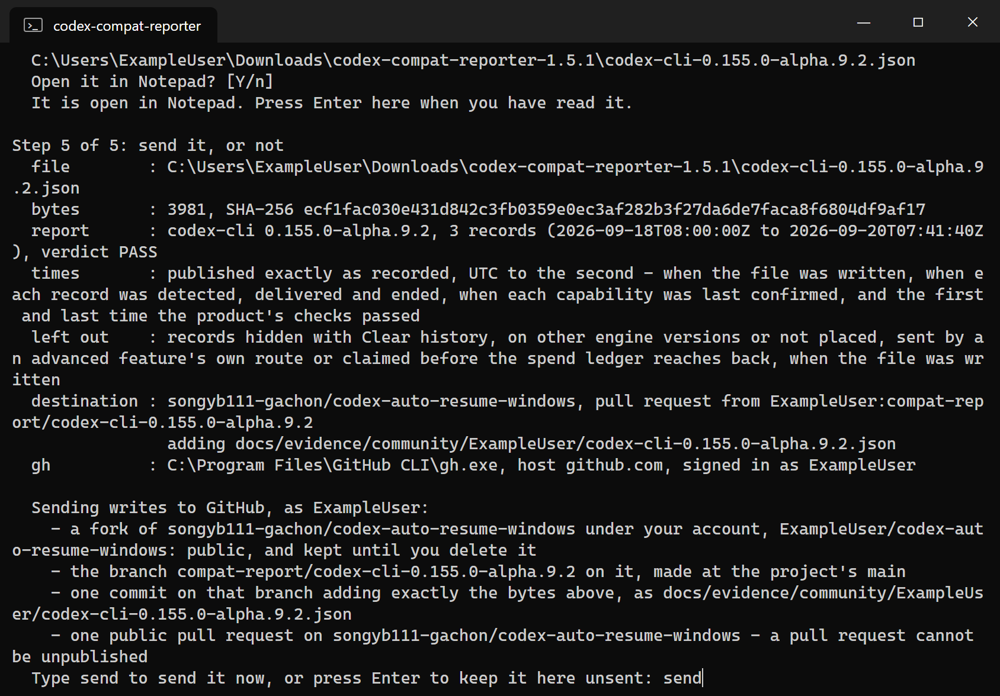
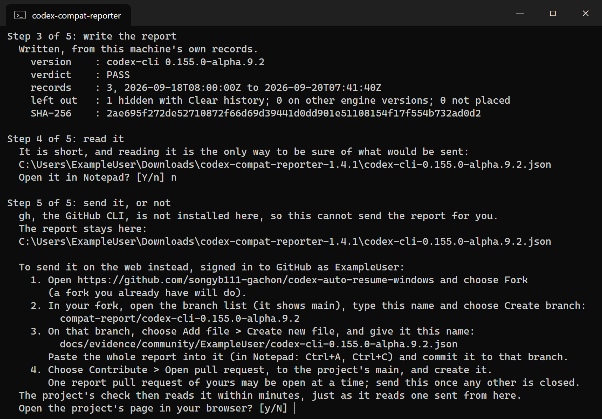

# codex-compat-reporter

[한국어](README.ko.md)

A small Windows tool that turns your own [Codex Auto Resume](https://github.com/songyb111-gachon/codex-auto-resume-windows)
installation's records into one JSON file you can send to the project: how the product behaved on
your machine, with your Codex version. Counts, states and times. Nothing you said to Codex.

The product's compatibility data says which Codex versions have been seen to work. Today only the
maintainer's own machine feeds it, which is one machine and one way of working. This is how yours
can say something too.

## Quick start

1. Download `CodexCompatReporter-<version>.exe` from
   [the latest release](https://github.com/songyb111-gachon/codex-compat-reporter/releases/latest)
   and double-click it. The whole reporter is in that one file, and it runs on the Python that Codex
   Auto Resume installed with itself, so there is nothing to unzip and nothing more to install.

   Windows may first say **Windows protected your PC**: the file is a program downloaded from the
   internet, and it is not signed. Choose **More info**, then **Run anyway**. What says where it came
   from is the release itself: `gh attestation verify CodexCompatReporter-<version>.exe --repo songyb111-gachon/codex-compat-reporter`
   proves the file was built from the release's tag by this repository's workflow on GitHub, and names
   the run and the commit (see [Get it](#get-it)).
2. Go through its five pages with **Next**. It shows what this machine can show, fills in the GitHub
   login the GitHub CLI is signed in as, writes the report in the folder the program is in and shows
   the whole file. Read it: it is short.
3. To send it, tick **I have read it** and choose **Send**. One more question follows, and its default
   answer is Cancel. Anything else sends nothing, and the file stays where it was written. Without the
   GitHub CLI signed in, the last page says step by step how to send the file on the web instead, with
   a **Copy** button beside each value to type.











The pictures are the window's own drawing of each page on a made-up machine - the one the guide's
pictures below show: the login ExampleUser, and records that belong to no one - made by
[tools/make_window_pictures.py](tools/make_window_pictures.py). Nothing was sent to make them.

### Or the ZIP

The same release has a second way to start: `codex-compat-reporter-<version>.zip`. Download it and
unzip it: right-click it and choose Extract All. In the folder that makes, double-click `Report.exe` -
the program above, byte for byte, under the name it has in the ZIP - and go on from step 2. Windows may
say **Windows protected your PC** of it too, and the same answer holds. Beside it are `Report.cmd`, the
same guide in a console window (below), the reporter itself, `codex_compat_report.py`, and what explains
them.

## Report.cmd: the same guide in a console window

`Report.cmd`, beside `Report.exe` in the same folder, is the same guide in a console window: the same
steps in the same words, one question at a time, for anyone who would rather answer in a console than
click through a window.

1. Double-click `Report.cmd` in the folder the ZIP was unzipped into. It runs on the Python that Codex
   Auto Resume installed with itself, so there is nothing more to install.
2. Answer its questions. It shows what this machine can show, asks for your GitHub login, writes the
   report and opens it in Notepad. Read it: it is short.
3. Type `send` to send it. Anything else sends nothing, and the file stays where it was written.
   Without the GitHub CLI signed in, it says step by step how to send the file on the web instead.









The pictures are the guide's real run on a made-up machine - the login ExampleUser, and records that
belong to no one - made by [tools/make_pictures.py](tools/make_pictures.py).

## Get it

The release in the quick start above has two ways to start: `CodexCompatReporter-<version>.exe`, the
window on its own, and the ZIP, which holds this file with `Report.exe` - that same window, byte for
byte - and `Report.cmd`, which runs `guide`, below. Each release is built from its tag by GitHub
Actions, with each file's SHA-256 beside it and one build attestation that names both:
`gh attestation verify <the file> --repo songyb111-gachon/codex-compat-reporter` says which workflow
run and commit made it. `Report.exe` is compiled in that same run, from
[gui/](gui/) by [tools/make_exe.py](tools/make_exe.py) with the C# compiler of .NET Framework 4.8 that
every Windows has, and the same sources and compiler give the same bytes, so it can be built again from
the tag and compared.

`Report.exe` decides nothing itself. It carries this file inside it - `codex_compat_report.py` as it
is at the release's tag, byte for byte, with its SHA-256 - which is why it runs on its own, and it runs
that copy and no other, in the ZIP too. It keeps the copy in a folder of your own,
`%LOCALAPPDATA%\codex-compat-reporter\` and then the first 16 hex digits of that SHA-256, and writes
it there again whenever the file there is missing or holds other bytes; before every start of Python
it reads the copy once more, and runs nothing that is not those bytes. If that folder cannot be
written, the window says so and runs nothing. It runs the copy with the Python `Report.cmd` would use,
isolated and with no console window, in the folder the program is in - so the report is written
there, and a `gh.exe` beside the program is never used - and shows what the file answers through its
`--json` interface - `survey`, `login`, `report --keep --json`, `submit --json` and
`web-steps --json`, one JSON object each. The window and the guide say the same words, made by the
same functions, and every byte of a report and of a send is this file's.

Started from Downloads, where anything else downloaded lies too, it loads no DLL from there. The first
thing it does is tell Windows to load DLLs from the System32 folder alone, and it runs nothing if
Windows will not, so a file beside it named as one of Windows' DLLs is not loaded in Windows' place.
Its tests start it beside copies of Windows' own DLLs and check that it loaded none of them from its
folder or from the current one.

One file it cannot refuse to read: .NET reads a `<program>.config` beside a program as it starts, before
the program's own code runs. The reporter never comes with one, so if one is beside it, it stops and says
so rather than running; but what such a file asks of .NET at the very start has happened by then. For
the strictest setup, keep the reporter in a folder of its own - the ZIP unzips to one - rather than
among other downloads.

It is one file of standard-library Python; there is nothing to install. Either clone the repository
and work in its folder:

```
git clone https://github.com/songyb111-gachon/codex-compat-reporter
cd codex-compat-reporter
```

or save [`codex_compat_report.py`](https://raw.githubusercontent.com/songyb111-gachon/codex-compat-reporter/main/codex_compat_report.py)
into a folder of its own and open a terminal there. The report is written into the folder you run
it from.

It needs:

- Windows, and Python 3.11 or newer. CI runs the tests on Python 3.11, 3.12, 3.13 and 3.14.
  `Report.exe` and `Report.cmd` need none of their own: they take the Python Codex Auto Resume
  installs, then the Python launcher, then `python.exe` from a folder on `PATH` - each by its full
  path, and never the one in the current folder or beside them, however `PATH` spells that folder.
  They start Python isolated (`-I`), so no module is taken from either folder.
- For `Report.exe`: .NET Framework 4.8, which is part of every Windows 10 and 11.
- Codex Auto Resume v0.6.0 or newer, installed, with its watcher having run at least once. It reads
  the state database of v0.6.0 to v0.6.11-alpha (schema 3) and of v0.6.11-beta and later (schema 4).
  A state, or an advanced-edition spend ledger, written by a newer Codex Auto Resume than it knows
  is never guessed at: `status` says it cannot be read, and `report` refuses and asks you to update
  codex-compat-reporter.
- For `submit` only: the [GitHub CLI](https://cli.github.com/), signed in with
  `gh auth login --hostname github.com`.

Every example below says `python`. Where the Python launcher is installed (the python.org
installer puts it there), `py` works the same; the Microsoft Store's Python has `python` but not
`py`.

## Use it

```
python codex_compat_report.py guide                           # all of the below, one question at a time
python codex_compat_report.py status                          # what this machine can show
python codex_compat_report.py report --login <your login>     # write the report
                                                              # ...now open the file and read it
python codex_compat_report.py submit <the file> --dry-run     # check everything, send nothing
python codex_compat_report.py submit <the file> --yes         # open the pull request
```

`report` writes `codex-cli-<version>.json`. Read that file - it is a plain, short document, and
reading it is the only way to be sure of what you are sending. `submit` sends exactly the bytes of
the file you name, as they are when you run it: it never rebuilds the report, and it never changes
the file. If you edit the file, what you saved is what is sent, provided it still follows
[the format](docs/REPORT_FORMAT.md); a file that does not is refused before anything leaves your
machine.

### Commands and options

| Command and option | What it does |
| --- | --- |
| `guide` | What `Report.cmd` runs: `status`, `report` and `submit`, one question at a time. It offers the login `gh` is signed in as, never writes over a file already there without a yes, opens the report in Notepad and the project's page in your browser only on a yes, and sends only when you type `send` - then exactly as `submit --yes` would, with the file's SHA-256 pinned as it was when you were asked. Without `gh` signed in as your login, it keeps the file and says how to send it on the web. Every question's default sends nothing. |
| `status` | Prints the installed product version, the Codex version it sees, how many records exist here (on this Codex version, on others, and not placed on any, with the reason), how many are hidden with Clear history, how many an advanced-edition feature sent by a route of its own (when any did), and whether the product's own checks passed on this version. Writes nothing. |
| `report --login LOGIN` | Writes the report for the Codex version installed now, filed under your GitHub login. Required. |
| `report --codex-version VERSION` | Reports on another Codex version this machine has records for, as `0.155.0` or `codex-cli 0.155.0`. `--version` is the same option. |
| `report --out FILE` | Writes the report to FILE instead of `codex-cli-<version>.json` in the current folder. The name you choose stays on your machine; see `submit`. |
| `report --force` | Writes over a file that is already there. Without it, `report` refuses, so a file you have read is never replaced behind your back. |
| `submit [FILE]` | Sends FILE. Without FILE it takes the one `codex-cli-*.json` in the current folder, and refuses if there is none or more than one. Without `--yes` or `--dry-run` it checks everything, says what it would do, sends nothing, and exits with 2. |
| `submit --dry-run` | Checks everything, says what it would write, and stops (exit 0). It still asks GitHub the read-only questions below. |
| `submit --yes` | Yes: writes to GitHub as listed below and opens the pull request. |
| `submit --login LOGIN` | Refuses unless the file is filed under LOGIN. |
| `submit --sha256 HEX` | Refuses unless the file's SHA-256 is HEX, as `report` printed it - a way to be sure the file is still the one you read. |
| `submit --write TEXT` | Given once for each write `--dry-run` listed, in its order: refuses unless sending would write exactly those - a way to be sure what is written to GitHub is what you were shown. `Report.exe` sends with it. |
| `--version`, `--help` | The tool's own version, and help. They read nothing. |

### Exit codes

| Code | Meaning |
| --- | --- |
| 0 | Done: `status` printed, `report` wrote the file, `submit --dry-run` checked everything, or `submit --yes` opened the pull request. For `guide`: it came to an end, whether it sent the report or you kept it. |
| 1 | An unexpected error - a bug. Please open an issue with what it printed. |
| 2 | Refused, with the reason and what to do on the error output. Nothing was sent, and nothing written, with two exceptions. `guide` may be refused after it has written the report: it keeps the file and says where it is. And a send - `submit --yes`, or `guide` after you typed `send` - can fail at a step on GitHub after earlier ones have written (the fork, the branch, the uploaded file). The message then lists what that run wrote, and sending again is safe: it keeps the fork, resets the branch to the project's main and adds the file again. Also a mistake in the command line. |
| 3 | `submit` or `guide`: the project is not taking reports yet. Nothing was sent; keep the file. |

## What it reads

Everything is read on your machine and opened read-only. The installation is
`%USERPROFILE%\.codex-auto-resume` unless `CODEX_AUTO_RESUME_HOME` names another folder, and the
Codex home is `%USERPROFILE%\.codex` unless `CODEX_HOME` does.

| It reads | For |
| --- | --- |
| `.codex-auto-resume\app\.codex-plugin\plugin.json` | the installed product version |
| `.codex-auto-resume\config\state.sqlite` | the recovery records: when each was detected, delivered and how it ended, its category, state and reason, which gates it passed, the thread and turn ids that key the count below, and the interruption id, client id and claim time that tell a record another route sent (below). Records hidden with Clear history are left out. |
| `.codex-auto-resume\config\advanced\advanced.sqlite` | only where the advanced edition keeps it: its spend ledger's interruption ids and times, which name the sends an advanced feature paid for |
| `.codex-auto-resume\logs\auto-resume.log` and `auto-resume.log.1` to `.5` | which Codex version was running around each record, and whether the product's own checks passed on it |
| `.codex-auto-resume\config\compatibility.json` | what the watcher itself concluded about the Codex installed now |
| `.codex\thread_history_*.sqlite` (the newest) | how many items of each kind the recovered turn produced |

A report is about the standard route: a continuation sent with `codex queue`, carrying a marker the
product finds in Codex's history to prove it arrived. The advanced edition has features that, once
you turn them on, continue a conversation by a route of their own - queued through Codex's app server
with no marker, or by setting the conversation's goal active again - and their records stay in the
same database. Counted, they would make the standard route look better or worse on that Codex version
than it was, and a report has no field to label them with. So each such record is left out, counted
and said, as a hidden one is, by the marks the product itself writes: the client id it gives a
marker-free continuation, a gate word only the edition's features write, and a unit the edition's
spend ledger paid at the claim the record was sent from. Nothing is guessed: a record no mark names
is the standard route's, which is every record on a standard installation.

Thread, turn and interruption ids, and the paths of these files, are read and used on your machine
only; they are never written into the report and never sent. One query passes over your conversation itself: to
count what the recovered turn produced, SQLite reads that turn's items in Codex's history and hands
back only a number per kind - never their text. The product itself does the same, and its
[privacy notes](https://github.com/songyb111-gachon/codex-auto-resume-windows/blob/main/docs/PRIVACY.md)
say so.

It writes nothing on your machine but the report file, and - during `submit --yes` only - a
temporary copy of the upload in your temporary folder, deleted as soon as it is sent. `Report.exe`
writes one file more, and only that one: its own copy of this file, in
`%LOCALAPPDATA%\codex-compat-reporter\` (see [Get it](#get-it)). Reading a
SQLite database that is in WAL mode lets SQLite update its shared-memory index (the `-shm` file),
as the product's own reads do; no data is written to the database itself. `guide` also opens
Notepad on the report, and the project's page in your browser, each only when you say yes.
`Report.exe` opens Notepad only when you choose Open in Notepad, and your browser only when you click
the project's page or, once it is sent, your pull request on it - the only two addresses it opens.

## What the report carries, and what is published

The file is what is published, and nothing else is: a pull request makes it public, for good.
It carries:

- your GitHub login, the tool's version, the Codex Auto Resume version, and the Windows build
  number (like `10.0.26200`);
- the Codex version it is about;
- per record: its category, state, reason and turn status - each one of the product's own words,
  and `other` for any word the tool does not know - how many gates it passed, and how many items
  of each kind the recovered turn produced;
- per capability: how many records confirmed or missed it, and the level that shows;
- how many times the product's own checks passed here, and on what;
- times, all UTC to the second and exactly as recorded: when the file was written, when each
  record was detected, delivered and ended, when each capability was last confirmed, and the first
  and last time the product's checks passed. Together they show when the product was busy on your
  machine.

It never carries message text, thread or turn ids, file paths, folder names, your Windows user
name, your Codex account, or anything you typed. The only free text in it is the login you pass
yourself. [The format](docs/REPORT_FORMAT.md) lists every field.

## What `submit` does on GitHub

It uses the `gh.exe` found in a folder on your `PATH` - never one in the current folder - and
every call names `github.com`, so a `GH_HOST` set for another server is not used. It signs in as
whatever `gh` is signed in as; a token with the `public_repo` scope is enough.

It asks GitHub these read-only questions first - under `--dry-run`, and without `--yes`, too:
whether `gh` is signed in, and as whom (it must be the login in the file); whether the project
takes reports yet (the folder `docs/evidence/community/` on its main branch); whether your report
for this Codex version is already filed there; whether any report pull request of yours is still
open (the project files one per account at a time); whether you have a fork of the project, and
whether the branch below is on it; and which commit the project's main is at.

Only with `--yes` does it write, as you:

1. a fork of `songyb111-gachon/codex-auto-resume-windows` under your account, when you have none -
   public, and kept until you delete it;
2. the branch `compat-report/codex-cli-<version>` on your fork, made at the project's main (or
   reset to it, when an earlier attempt left it behind);
3. one commit on that branch adding the exact bytes of your file as
   `docs/evidence/community/<your login>/codex-cli-<version>.json`;
4. one public pull request to the project. A pull request cannot be unpublished.

GitHub takes a moment to copy a new fork, so `submit` waits up to a minute for it before making
the branch. If a step fails part-way, what the earlier steps wrote stays on GitHub and the refusal
lists it. Running `submit` again is safe: it keeps the fork, resets the branch to the project's
main and adds the file again.

`guide` asks the first two questions - whether `gh` is signed in, and as whom - when it asks for
your login, to offer the one `gh` has. When you type `send` it asks all of them again and writes
exactly as `submit --yes` does, with the SHA-256 of the file pinned as it was when you were asked: a
file changed since then, or a list of writes that is no longer the one you were shown, is refused
and nothing is sent. `Report.exe` asks the same two when it fills in your login, lists the writes on
its last page from a `--dry-run`, and on Send - after I have read it, and one more question whose
default answer is Cancel - runs `submit --yes` with the SHA-256 of the bytes it showed you and the
writes it listed pinned (`--sha256` and `--write`): there too a changed file, or a list of writes that
is no longer the one shown, is refused and nothing is sent.

The name in the project is always `codex-cli-<version>.json` under your login, whatever you called
the file on your machine. There is one report per GitHub login per Codex version, and one open
report pull request per account at a time: `submit` refuses when yours is already filed, or when a
report pull request of yours is still open - close that one on GitHub first to send again. The login may not be a name Windows keeps for a device
(`con`, `nul`, `com1` and the rest), since no Windows checkout of the project could hold that
folder, and the Codex version is written the one way the product writes it (`0.155.0`, never
`00.155.0`).

## What happens after `submit`

Nothing more is needed from you. `submit` ends by saying so, after the pull request's address.

1. **Judged, within minutes.** The project's own check reads your pull request as data - it never
   runs anything in it - and says on the pull request whether the report passes.
2. **Filed by the project's code, with no one's step.** A report that passes is filed by the
   project's filer, usually within minutes and otherwise on its daily run. It judges the report
   again against the project's main as it is then, and keeps the project's own regeneration of it:
   every conclusion recomputed from your records, every sentence replaced by the project's. Your
   bytes are never what is kept.
3. **Closed, with one comment.** Your pull request is then closed, not merged, because the kept file
   is the regenerated one. One comment says where the report went. That comment is edited, never
   repeated, whenever what it says changes.

A report can also wait. The comment then gives the reason and when it is looked at again, and there
is nothing for you to do:

- an account younger than 30 days: the pull request is closed with the date it can be sent again;
- another report pull request of yours still open: the newer one is closed, and can be sent again
  once the first is closed;
- 3 reports already filed from your account, or 5 for your Codex version, in the last 7 days;
- a Codex version older than those the project's own data names, or a report of a failure on a
  version the project's own evidence verifies: the maintainer looks at those first;
- the project's own tests failing, or filing paused by the maintainer.

A refused pull request's comment says, line by line, what to do about each reason - most often to
close that pull request, write the report again with the latest reporter and run `submit --yes`
again. Closing it comes first because `submit` sends nothing while a report pull request of yours is
open. A new commit on the pull request is judged again; one refused and left unchanged for 14 days
is closed. A new report is welcome any time.

## What a report can and cannot do

A report is a measurement, not a verdict. When one arrives, the project recomputes every derived
field from the records in it, so a conclusion edited by hand does not survive the trip.

Community reports have a grade of their own: **Reported**. What is known about a Codex version is
said with four words, and they are a ladder - *verified*, *checked*, *compatible* and *failed
here*. Reported is not one of them and never becomes one. It is shown beside the version, as its
own grade, with the number of reports that said the same thing: N reported it working, M reported
a failure, K reported nothing either way. There is one report per GitHub login per Codex version, so
these are reports, not machines.

- A version whose own evidence says nothing stays **compatible** however many reports arrive.
- Reports **never raise a version's tier** to Verified or Checked, and never change what the
  product allows itself to do on anyone's machine. A version's tier still comes from evidence the
  maintainer recorded, and from your own installation's local checks.
- What they do is show that a version behaved - or did not - somewhere other than one machine. A
  version that fails for you is the most useful report there is.

Nothing here can prove a file was not written by hand on the machine that sent it. That is why
Reported stands beside the ladder and grants nothing, rather than being checked with ceremony and
then trusted. [The format](docs/REPORT_FORMAT.md) says exactly how a report is counted.

## When the project takes reports

The receiving side is in the product from v0.6.10: its Diagnostics page shows these counts beside a
version, and the project files a report that passes by itself. Until the folder
`docs/evidence/community/` exists on the product's main branch, `submit` says so, sends nothing and
exits with 3, and `report` still works: keep the file and send it when the door opens.

MIT licensed. Issues and pull requests are welcome, in English or Korean.
